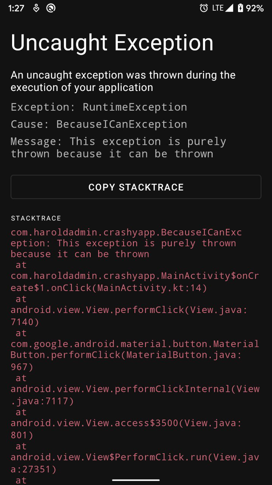

# WhatTheStack

WhatTheStack is a library to make your debugging experience on Android better.

WhatTheStack shows you a pretty error screen when your Android App crashes, instead of a boring old dialog saying "Unfortunately, \<your-app\> has crashed".

## Setup

All that is needed to initialize this library is to use the `init()` method in the `onCreate()` callback of your custom Application class.

```kotlin
class MyApp : Application() {
    override fun onCreate() {
        super.onCreate()
        WhatTheStack(this).init()
    }
}
```

And when an error is thrown in your application, you shall be greeted with a screen similar to this:

]

## Under the hood

This library works by setting a default uncaught-exception-handler on your app. When an uncaught exception is thrown, it is caught by this handler and sent to the library to parse and display to you. This is accomplished by running a bound service in a separate process than your app.

Running in a separate process is important because when an uncaught exception is thrown, the main thread of your application becomes unable to perform an UI related actions, and hence can't launch an intent to display the error screen shipped with this library. Therefore, running in a separate process allows us to perform UI related actions even when the main thread of the app process has stopped.

## Installation

Add Jitpack repository in your root `build.gradle` file:

```groovy
allprojects {
  repositories {
    ...
    maven { url 'https://jitpack.io' }
    }
}
```

And then add the dependency to your app:

```groovy
dependencies {
  implementation 'com.github.haroldadmin:WhatTheStack:(latest-version)'
}
```

[](https://jitpack.io/#haroldadmin/WhatTheStack)

## Contributing

Contributions to this library are very welcome. I threw this together over one weekend, and it hasn't been thoroughly tested. Community validation and contributions would therefore be great.
