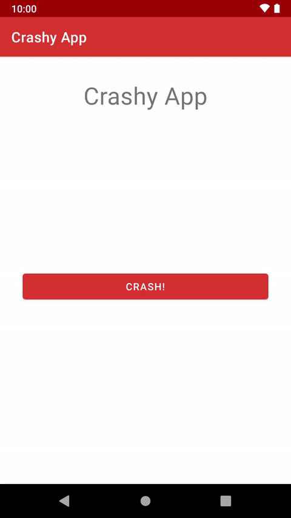
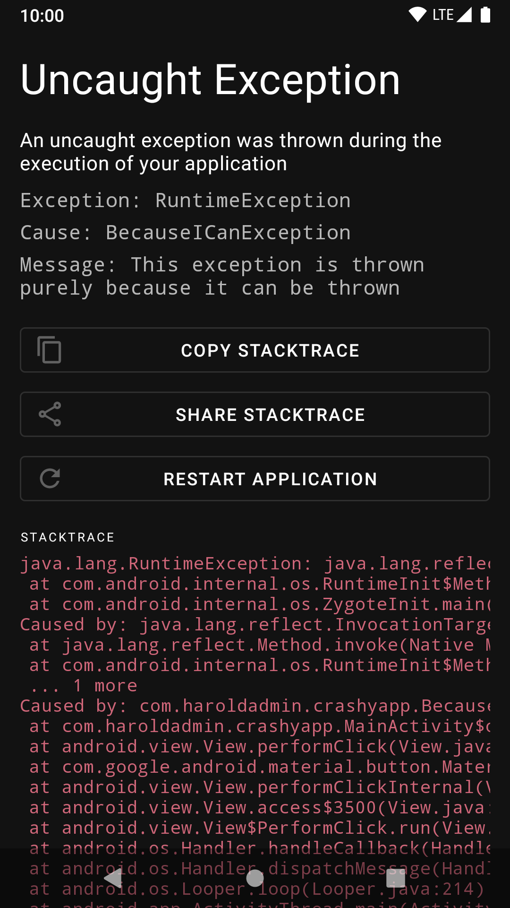
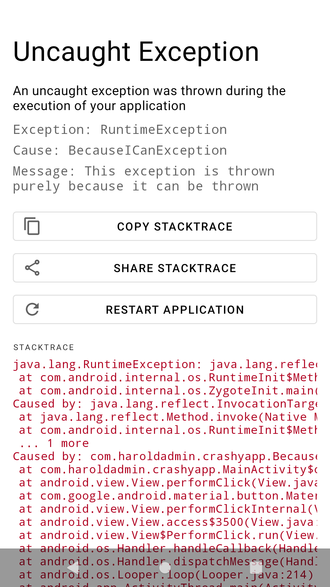

# WhatTheStack


WhatTheStack is a library to make your debugging experience on Android better.

It shows you a pretty error screen when your Android App crashes, instead of a boring old dialog saying "Unfortunately, \<your-app\> has crashed".



## Setup

[](https://jitpack.io/#haroldadmin/WhatTheStack)

Add Jitpack repository in your root `build.gradle` file:

```groovy
allprojects {
  repositories {
    maven { url 'https://jitpack.io' }
  }
}
```

And then add the dependency to your app:

```groovy
dependencies {
  debugImplementation 'com.github.haroldadmin:WhatTheStack:(latest-version)'
}
```

Now when an uncaught exception is thrown in your application, you will be greeted with a screen containing information about the crash. We support light and dark themes too!




## Usage

WhatTheStack works by overriding the default exception handler in your app. It processes any uncaught exception in your app, parses it to extract useful information, and then shows it in a pretty screen.

### Automatic Initialization

WhatTheStack uses the [Jetpack App Startup](https://developer.android.com/topic/libraries/app-startup) library to run automatically when your app starts. You don't need to write any code to initialize it manually.

<details>
  <summary>Need to disable automatic initialization?</summary>
  If you want to disable automatic startup, add the following lines to your Manifest file:

  ```xml
  <provider
    android:name="androidx.startup.InitializationProvider"
    android:authorities="${applicationId}.androidx-startup"
    android:exported="false"
    tools:node="merge">
    <meta-data  android:name="com.haroldadmin.whatthestack.WhatTheStackInitializer"
      android:value="androidx.startup"
        tools:node="remove"/>
  </provider>
  ```
</details>

### Debug vs Release builds

We recommend using `WhatTheStack` in debug builds only. We see it as a tool to improve the experience of the developer, not the user.

<details>
<summary>Need to use it in release builds?</summary>
If you want to use WhatTheStack in release builds, replace the `debugImplementation` dependency with `implementation'.

```diff
dependencies {
-  debugImplementation 'com.github.haroldadmin:WhatTheStack:(latest-version)'
+  implementation 'com.github.haroldadmin:WhatTheStack:(latest-version)'
}'
```

The library ships with Proguard rules to ensure that it works correctly even after minification.
</details>

## Contributions

We are happy to accept any external contributions in the form of PRs, issues, or blog posts. 

Please consider starring the repository if you find it useful or intriguing!
